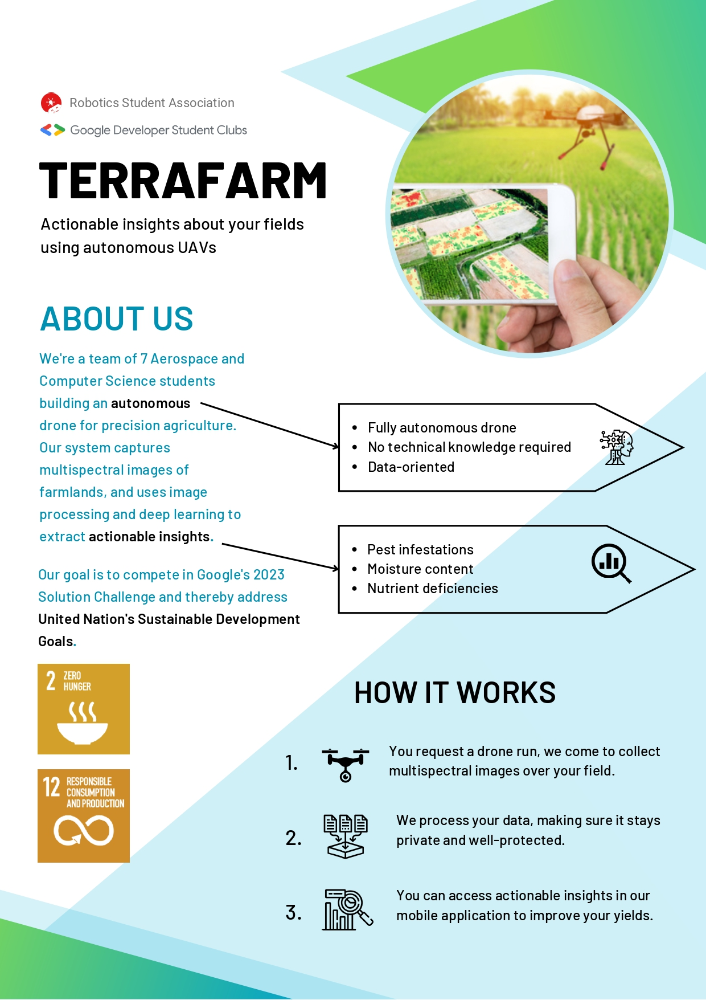
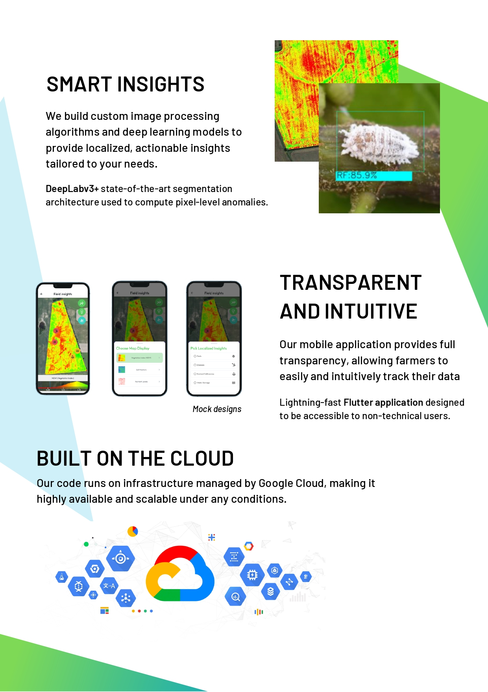

<!-- TODO: add code coverage? -->
# Terrafarm


## About

### Problem we solving
Growing (high-quality) crops sustainably for an ever-increasing population is one of the biggest challenges we face today, as farmers all over the world are faced with complex decision making problems for a vast amount of crops. To this end, a variety of parameters need to be traced - think of application of fertilizer, soil humidity or availability of nutrients.

In traditional agriculture, fields are treated as homogeneous entities, which generally leads to sub-optimal treatment due to lack of (localized) traceability. This is problematic, as oversupply of agricultural inputs leads to environmental pollution. Moreover, unnecessary large quantities can go to waste if produce are not harvested at their optimal time. Finally, this clearly leads to low yield density and hence missed profits for farmers.

[Precision agriculture](https://en.wikipedia.org/wiki/Precision_agriculture) on the other hand, aims to produce more crops with fewer resources while maintaining quality. This sustainable agricultural model utilizes IT solutions to allow for localized treatment to a much finer degree. This paradigm shift is becoming increasingly urgent because of the worldwide increase in food demands for example: the number of people who will require food in 2050 is estimated at nine billion.

### Our solution
Our **mobile app Terrafarm** allows farmers to perform **smart monitoring, analysis and planning** in an intuitive and affordable manner. In fact, our system uses **image processing and deep learning** to extact **actionable insights** from multispectral drone images. These insights - think of pest infestations, moisture content or nutrient deficiencies - are visualized to users, thereby providing full transparancy. We aim to target both small- and medium-scale farmers. Detailed information about our image processing pipeline and Flutter mobile app can be found under `apa/src/backend` and `apa/src/frontend` respectively.

<div>
    
    
</div>

<p style="text-align:center;">Figure: Information poster presenting Terrafarm</p>


# Build Tools


</br>

</br>

</br>

</br>

</br>

</br>

</br>


# Getting Started

Follow these steps to set up your project locally.

Clone the repo
```
git clone https://github.com/GDSC-Delft-Dev/apa.git
```

## Setup backend

Setup virtual python environment
```
pip install virtualenv
virtualenv env
```

Activate on MacOS or Linux
```
source env/bin/activate
```

Activate on Windows
```
source env/Scripts/activate
```
Install Python requirements
```
pip install -r requirements.txt
```
Please refer to `apa/src/backend/README.md` for detailed information on the image processing pipeline.
<!-- TODO: Perhaps more info? -->

## Setup frontend
Please refer to `apa/src/frontend/README.md`.


# Contributing
Anyone who is eager to contribute to this project is very welcome to do so. Simply take the following steps:
1. Fork the project
2. Create your own feature branch
3. Commit your changes
4. Push to the `dev` branch and open a PR

# Datasets
You can play with the datasets in the `notebooks` folder.


# License
Distributed under the MIT License. See `LICENSE.txt` for more information.

# Contact
- Google Developers Student Club Delft - dsc.delft@gmail.com
- Paul Misterka - pawel.mist@gmail.com
- Mircea Lica - mirceatlx@gmail.com
- David Dinucu-Jianu - david.dinucujianu@gmail.com
- Nadine Kuo - kuonadine@gmail.com
<!-- Not sure if I shou -->
