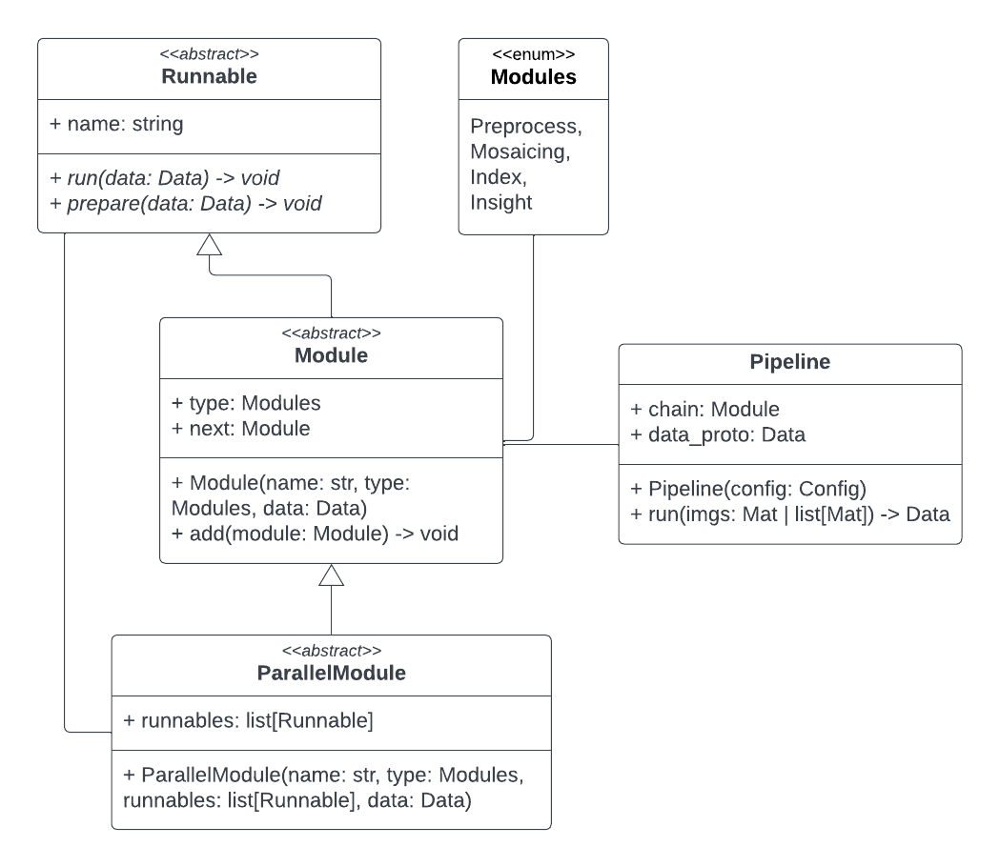

## Pipeline

The image processing pipeline is the main construct of our project. When provided with images from a flyover, the pipeline computes indicies (i.e. vegetation index, mositure content) to estimate relevant information and provides insights (e.g. nutrient deficiencies, infestations) locally. This data is saved in the database, and can be visualized in the user interface, or used for further analysis (e.g. model training, statistical analysis).

<p align="center">
    <p align="center">
        
        &nbsp &nbsp
        
    </p>
</p>
<p align="center">Example of image mosaicing</p>

### Modules
To make the code extendible, maintainable, and multithreaded, the pipeline is divided into modules. Modules are run sequentially, and each can have multiple implementations that execute different logic, but compute the same type of data. We distinguish the following modules:
- Mosaicing module - transforms the flyover images into a single farmland bird's eye view image
- Index module - computes pixel-level indicies that provide general information about the field
- Insight module - evaluates the database and indicies to provide actionable and localized insights that identify issues and improve farming efficiency

Each module automatically verifies its dependencies (e.g. to identify moisture content near-infrared spectrum is required) and provide statistics about no. of executions, success rates, and processing times.

### Pipeline configuration
To configure a pipeline you must provide the input data and module types you'd like to run. This is done through the config class:
```
from .types import Modules
from pipeline import Pipeline

cfg = Config(modules=[MOSAIC, INDEX, INSIGHT])
pipeline = Pipeline(cfg)
```
Running this code will spawn a pipeline instance that can perform a job. The pipeline creation might fail if the configuration is invalid, e.g. when the user wants to detect an insight that relies on the `NDVI` index, but that index isn't calculated by the pipeline.

### Running the pipeline
To run the pipeline use `.run()`:
```
from .Mat import Mat

imgs: list[Mat] = ...
pipeline.run(imgs)
```

Note that the input images must be wrapped in the `Mat` class (wrapping a `cv2.Mat` class) to support images with various multispectral layouts.

### Implementing modules
The pipeline modules utilize OOP principles heavily in order to be chainable, and to enable simple performance reporting and analytics. We discern three types of module-related objects and the pipeline data object:



To add functionality, implement one of these abstract classes.

#### Runnable
The runnable is the simplest form of a pipeline element. While it is the building block of modules, the user can implement Runnables that are run by modules (such as `NDVI`).

#### Module
The module is a logical part of the image processing pipeline, chained sequentially with other pipelines. A module will perform its functionality when being `run()` and save the relevant data in the pipeline data object that will be passed to the following module. Note that your implementation should invoke `super().run(data)` after your module logic. 

#### Parallel module
The parallel module is a module that can run multiple threads of execution at the same time, essentially allowing parallel module invocations. Parallel modules implement logical groups of functionalities, such as the calculation of all indicies (e.g. `NDVI` and `Mositure`) that do not rely on each other.

#### Pipeline data object
The data object contains all data relevant to the pipeline job. The pipeline initializes the data object dynamically through the use of the `prepare()` method. Note that, similarily to constructors, the preparation of your implementation should follow the preparation of the base class.