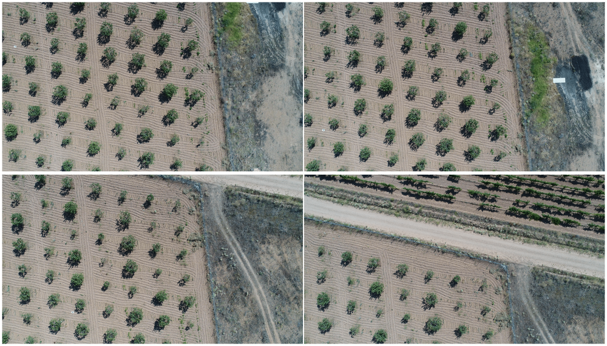

## Pipeline

The image processing pipeline is the main construct of our project. When provided with images from a flyover, the pipeline computes indicies (i.e. vegetation index, mositure content) to estimate relevant information and provides insights (e.g. nutrient deficiencies, infestations) locally. This data is saved in the database, and can be visualized in the user interface, or used for further analysis (e.g. model training, statistical analysis).

    

        
        &nbsp &nbsp
        
    

    <i align="center">Example of image mosaicing</i>

### Modules

To make the code extendible, maintainable, and multithreaded, the pipeline is divided into modules. Modules are run sequentially, and each can have multiple implementations that execute different logic, but compute the same type of data. We distinguish the following modules:
- Mosaicing module - transforms the flyover images into a single farmland bird's eye view image
- Index module - computes pixel-level indicies that provide general information about the field
- Insight module - evaluates the database and indicies to provide actionable and localized insights that identify issues and improve farming efficiency

Each module automatically verifies its dependencies (e.g. to identify moisture content near-infrared spectrum is required) and provide statistics about no. of executions, success rates, and processing times.